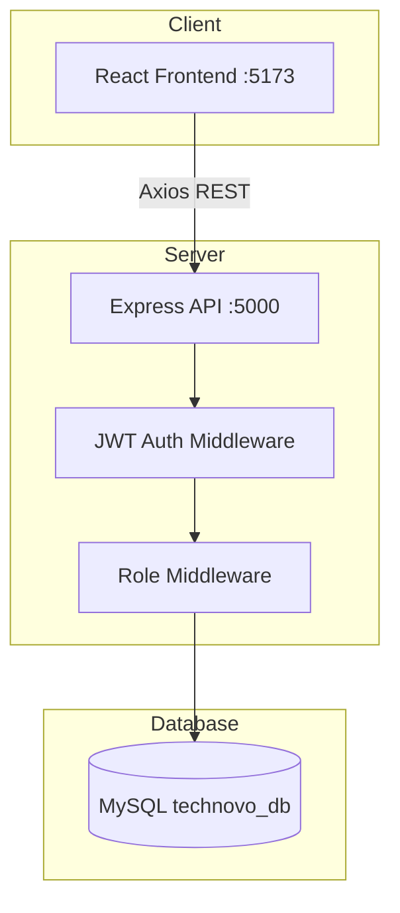
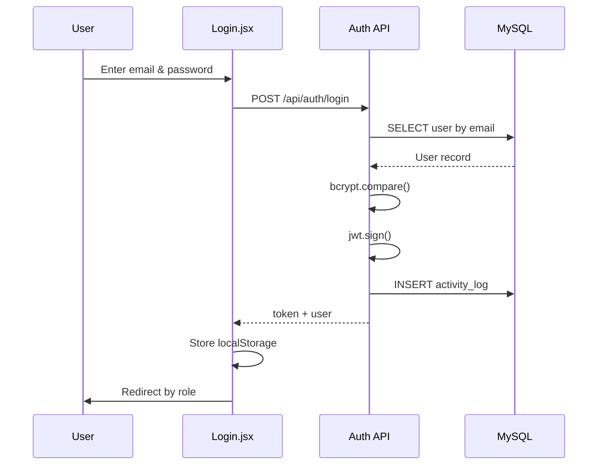
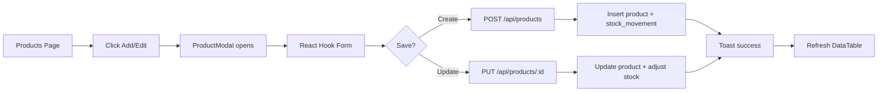
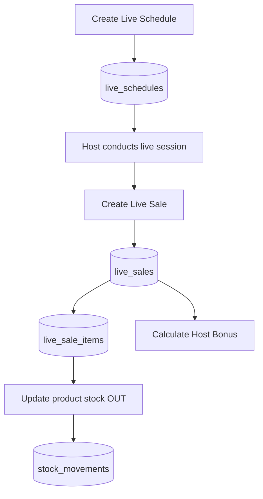
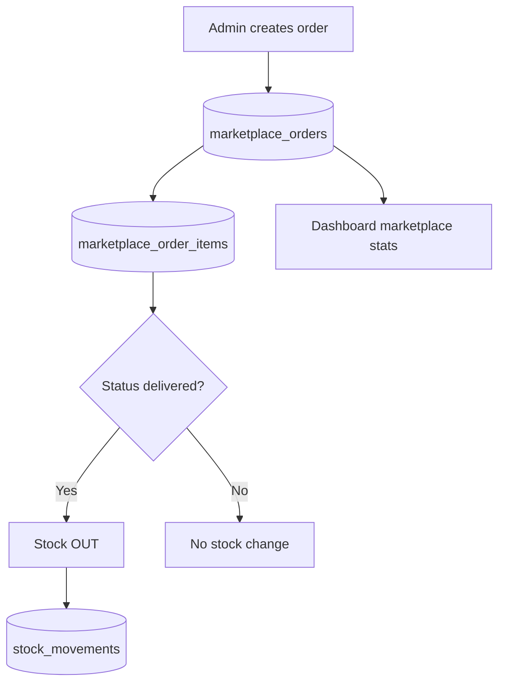
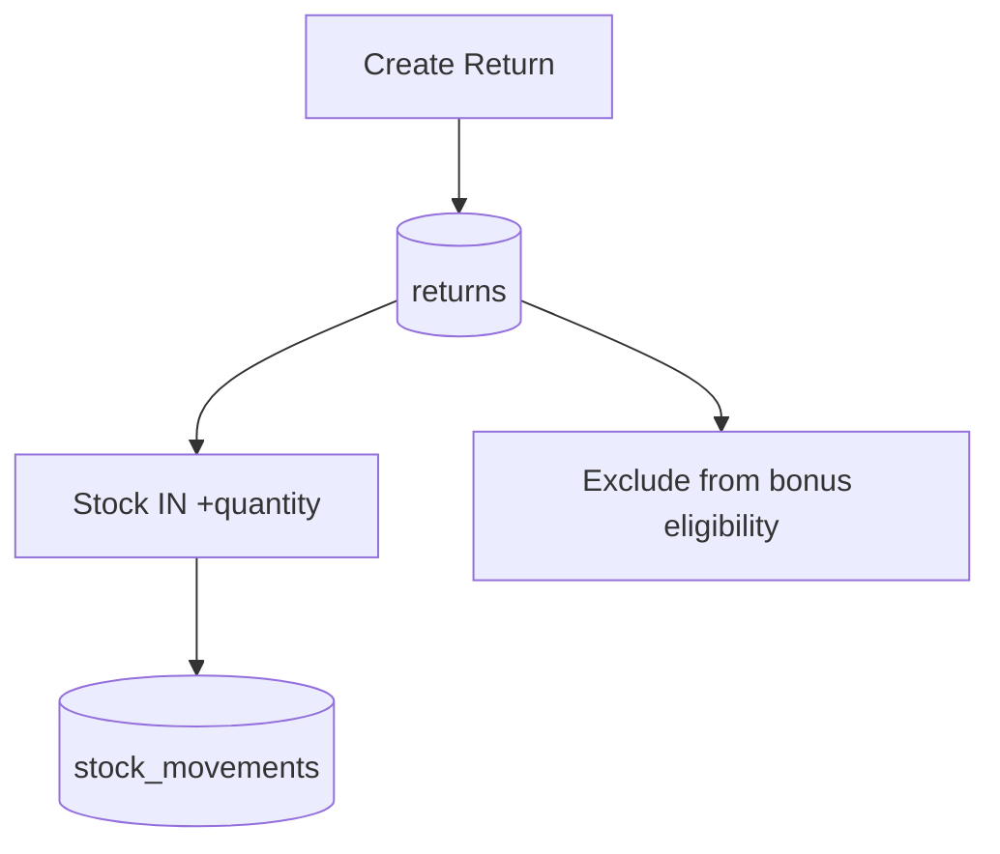
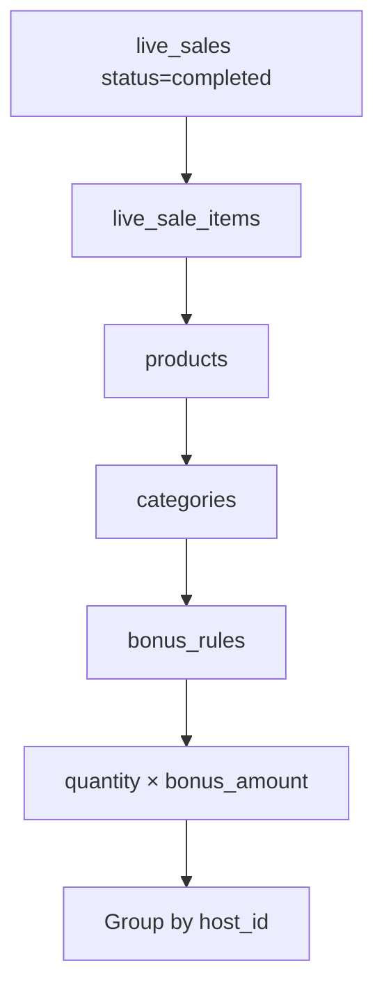

# TECHNOVO - System Flow Explanation

## Overview

TECHNOVO adalah sistem monitoring penjualan online yang mengintegrasikan **Live Shop Sales** dan **Marketplace Orders** dalam satu dashboard analytics dengan kontrol akses berbasis role.

---

## System Architecture Diagram



---

## Login Flow



**Role Redirect:**
- LEADER → `/leader/dashboard`
- ADMIN → `/admin/dashboard`
- HOST → `/host/dashboard`

---

## Product CRUD Flow (Modal Pattern)



**Design Rule:** Tidak ada halaman Add/Edit terpisah — semua CRUD via Material UI Dialog (700-900px).

---

## Live Schedule → Live Sales Flow



1. Leader membuat jadwal live (host + platform + tanggal)
2. Setelah live selesai, input live sale dengan items
3. Sistem kurangi stok produk otomatis
4. Bonus host dihitung dari item yang terjual

---

## Marketplace Order Flow



Admin/Leader memantau order dari 4 platform marketplace dengan filter status.

---

## Return Flow



Return hanya untuk marketplace orders. Stok dikembalikan ke inventory.

---

## Bonus Calculation Flow



### Formula Detail

```
IF category = 'Laptop'     THEN bonus = qty × 10.000
IF category = 'Chromebook' THEN bonus = qty ×  3.000

Total Host Bonus = Σ bonus per item (completed live sales only)
```

### Business Logic

| Condition | Bonus Eligible |
|-----------|----------------|
| Live sale completed | ✅ Yes |
| Order delivered (marketplace) | ❌ No (bonus hanya live) |
| Product returned | ❌ No (returns = marketplace) |

---

## Dashboard Data Flow

```mermaid
flowchart LR
    D[Dashboard Page] --> API[GET /api/dashboard/{role}]
    API --> Q1[Summary queries]
    API --> Q2[Chart queries]
    API --> Q3[Recent activities/orders]
    Q1 --> R[JSON response]
    Q2 --> R
    Q3 --> R
    R --> UI[StatCards + Recharts + Tables]
```

---

## Table Features Flow

Semua halaman list menggunakan komponen `DataTable`:

| Feature | Implementation |
|---------|----------------|
| Search | TextField → query param `search` |
| Filter | Select dropdown → query params |
| Pagination | MUI TablePagination → `page`, `limit` |
| Sort | TableSortLabel → `sortBy`, `sortOrder` |
| Export CSV | Client-side exportToCSV helper |

---

## Responsive Sidebar Flow

| Breakpoint | Behavior |
|------------|----------|
| Desktop (lg+) | Sidebar fixed 260px |
| Tablet (md-lg) | Sidebar collapsed 72px |
| Mobile (xs-md) | Drawer toggle via hamburger |

---

## Seed Data Summary

| Data | Count | Period |
|------|-------|--------|
| Users | 5 | - |
| Platforms | 4 | - |
| Categories | 2 | - |
| Products | 20 | - |
| Customers | 100 | - |
| Live Schedules | 360 | Feb-May 2026 |
| Live Sales | 360 | Feb-May 2026 |
| Marketplace Orders | 1050+ | Feb-May 2026 |
| Returns | 20 | Feb-May 2026 |
| Stock Movements | 70+ | Feb-May 2026 |
| Activity Logs | 200 | Feb-May 2026 |

Regenerate: `cd backend && npm run generate-sql`

---

## Security Flow

1. Password hashed with bcrypt (10 rounds)
2. JWT expires in 24h (configurable via `.env`)
3. Every protected route requires valid Bearer token
4. Role middleware enforces permission per endpoint
5. 401 response triggers auto logout di frontend

---

## Notification Flow

```
CRUD Action → API Success → toast.success('Product created successfully')
CRUD Error  → API Error   → toast.error(message)
Login       → toast.success('Login successful')
```

Using React Toastify with `position="top-right"`, `autoClose={3000}`.
